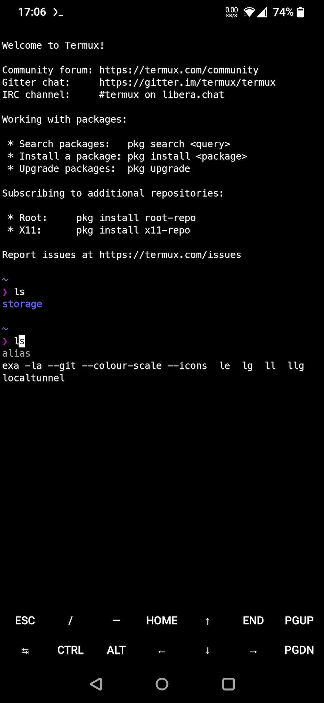

# My Termux



My own environment for Termux.<br>
Scripts, themes, dotfiles.<br>
All what I need.<br>

<br>
<br>
<br>
<br>
<br>
<br>
<br>
<br>

## Requirements

- [Termux](https://f-droid.org/en/packages/com.termux)
  Run scripts when your device boots.

## Installation

```shell
yes|pkg upgrade -y && pkg install -y openssl curl zsh && chsh -s zsh && termux-setup-storage && echo " " && echo "Done! Please exit and start Termux."
```

```
curl --silent https://raw.githubusercontent.com/kud/my-termux/main/core/start.sh -H 'Cache-Control: no-cache, no-store; Pragma: no-cache'|zsh
```

## Post-installation

- Set "Nancy" as style for Termux
- Set "Hack" as font-style for Termux

## Termux:Addons

- [Termux:Boot](https://f-droid.org/en/packages/com.termux.boot)
  Run scripts when your device boots.

- [Termux:API](https://f-droid.org/en/packages/com.termux.api)
  Access Android and Chrome hardware features.

- [Termux:Float](https://f-droid.org/en/packages/com.termux.window)
  Run Termux in a floating window.

- [Termux:Styling](https://f-droid.org/en/packages/com.termux.styling)
  Have color schemes and powerline-ready fonts customize the appearance of the Termux terminal.

- [Termux:Task](https://f-droid.org/en/packages/com.termux.tasker)
  An easy way to call Termux executables from Tasker and compatible apps.

- [Termux:Widget](https://f-droid.org/en/packages/com.termux.widget)
  Start small scriptlets from the home screen.
